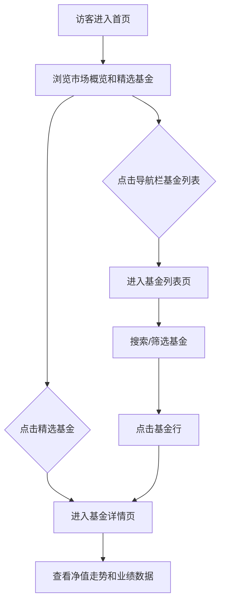

## 1. 产品概述

睿盈基金是一个面向个人投资者的基金信息展示平台，提供基金产品的浏览、筛选、对比和详情查看功能。平台以简洁优雅的设计传递专业与信任感，帮助用户快速了解基金市场动态和产品详情。

- 目标用户：有理财需求的个人投资者
- 核心价值：一站式基金信息聚合，直观的数据可视化，降低投资决策门槛

## 2. 核心功能

### 2.1 用户角色

| 角色 | 访问方式 | 核心权限 |
|------|----------|----------|
| 访客用户 | 无需注册 | 浏览基金列表、查看基金详情、查看市场趋势 |

### 2.2 功能模块

1. **首页**：Hero 大屏区、基金市场概览数据、市场趋势图表、精选基金推荐
2. **基金列表页**：基金搜索、分类筛选、多维度排序、分页浏览
3. **基金详情页**：基金基本信息、净值走势图表、历史业绩数据、风险指标展示

### 2.3 页面详情

| 页面名称 | 模块名称 | 功能描述 |
|----------|----------|----------|
| 首页 | Hero 区域 | 展示平台主标题与价值主张，动态数值滚动展示关键市场指标 |
| 首页 | 市场概览 | 以卡片形式展示 A股/港股/美股三大市场核心指数及涨跌幅 |
| 首页 | 市场趋势 | 折线图展示近一月市场整体走势，支持切换不同指数 |
| 首页 | 精选基金 | 网格展示 6 只精选基金卡片，含名称、类型、年化收益率、风险等级 |
| 基金列表 | 搜索栏 | 支持按基金名称/代码实时搜索 |
| 基金列表 | 筛选区 | 按基金类型（股票型/混合型/债券型/货币型/指数型）筛选，按收益率/规模排序 |
| 基金列表 | 基金表格 | 表格展示基金列表，含名称、代码、类型、净值、日涨跌幅、近一年收益 |
| 基金列表 | 分页器 | 底部分页导航，支持翻页 |
| 基金详情 | 基本信息 | 基金名称、代码、类型、基金经理、成立日期、基金规模 |
| 基金详情 | 净值走势 | 交互式折线图，支持 1月/3月/6月/1年/全部 时间范围切换 |
| 基金详情 | 业绩数据 | 表格展示近1月/3月/6月/1年/3年各阶段收益率 |
| 基金详情 | 风险指标 | 卡片展示最大回撤、波动率、夏普比率、Alpha等关键指标 |

## 3. 核心流程

## 4. 用户界面设计

### 4.1 设计风格

- **主色调**：深色背景 (#0A0E17) 为主，金色 (#D4A853) 和琥珀色 (#F0A050) 作为强调色，传达高端、信任、稳健的品牌气质
- **辅助色**：涨为翠绿色 (#22C55E)，跌为珊瑚红 (#EF4444)，中性灰 (#64748B)
- **按钮风格**：圆角 8px，金色实心主按钮，边框次按钮，带 hover 发光效果
- **字体**：标题使用 Playfair Display（衬线体，优雅高级），正文使用 DM Sans（无衬线体，现代清晰）
- **布局风格**：宽屏居中最大宽度 1280px，卡片式布局，大量留白与呼吸感，桌面优先
- **图标风格**：lucide-react 图标库，线条风格，与文字颜色一致

### 4.2 页面设计概览

| 页面名称 | 模块名称 | UI 元素 |
|----------|----------|---------|
| 首页 | Hero 区域 | 深色渐变背景 + 金色网格纹理，大标题 Playfair Display，副标题 DM Sans，动态计数器跳动动画 |
| 首页 | 市场概览 | 3 列卡片，半透明玻璃态背景，指数名称 + 数值 + 涨跌幅（绿涨红跌），hover 微上浮效果 |
| 首页 | 市场趋势 | 深色卡片容器，Recharts 折线图，金色线条，半透明填充区域，时间范围切换标签 |
| 首页 | 精选基金 | 3x2 网格，玻璃态卡片，基金名称 + 类型标签 + 年化收益率大数字 + 风险等级星级 |
| 基金列表 | 搜索栏 | 圆角输入框，搜索图标，聚焦时金色边框发光 |
| 基金列表 | 筛选区 | 水平排列的类型标签按钮，选中态金色填充，右侧排序下拉 |
| 基金列表 | 基金表格 | 深色表头，斑马纹行，hover 行高亮，涨跌幅颜色区分 |
| 基金详情 | 净值走势 | 大尺寸折线图，带时间范围切换标签，tooltip 显示详细数据 |
| 基金详情 | 风险指标 | 4 列卡片，图标 + 指标名 + 数值，半透明背景 |

### 4.3 响应式设计

- 桌面优先设计（1280px 基准）
- 平板端（768px-1024px）：卡片网格调整为 2 列，表格横向滚动
- 移动端（<768px）：单列布局，导航折叠为汉堡菜单，表格改为卡片列表

### 4.4 动画与微交互

- 页面加载：各模块依次淡入上移（staggered fade-in-up）
- 数字跳动：计数器数字滚动动画
- 卡片 hover：轻微上浮 + 阴影加深 + 边框发光
- 图表：折线图绘制动画
- 页面切换：路由过渡淡入效果