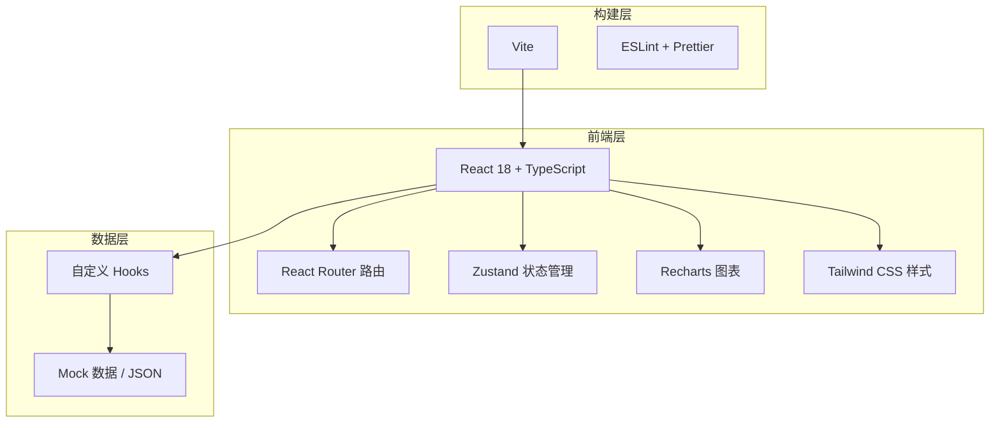
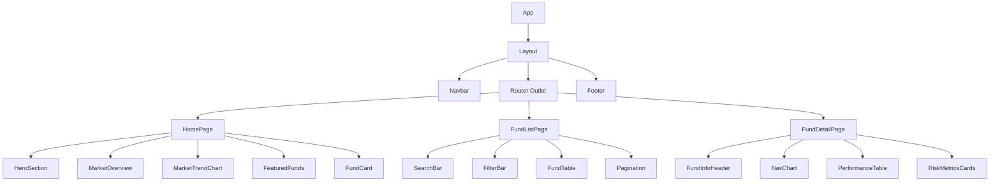

## 1. 架构设计



## 2. 技术选型

- **前端框架**：React 18 + TypeScript
- **样式方案**：Tailwind CSS 3
- **路由**：React Router DOM v6
- **状态管理**：Zustand
- **图表库**：Recharts
- **图标库**：lucide-react
- **构建工具**：Vite
- **初始化工具**：vite-init（react-ts 模板）
- **包管理器**：npm
- **后端**：无（纯前端项目，使用 Mock 数据）

## 3. 路由定义

| 路由 | 页面组件 | 用途 |
|------|----------|------|
| / | HomePage | 首页，展示市场概览和精选基金 |
| /funds | FundListPage | 基金列表，支持搜索筛选排序 |
| /funds/:id | FundDetailPage | 基金详情，展示走势和指标 |

## 4. 数据模型

### 4.1 基金数据模型

```typescript
interface Fund {
  id: string;
  code: string;           // 基金代码，如 "000001"
  name: string;           // 基金名称
  type: FundType;         // 基金类型
  manager: string;        // 基金经理
  establishDate: string;  // 成立日期
  scale: number;          // 基金规模（亿元）
  nav: number;            // 单位净值
  accumulatedNav: number; // 累计净值
  dailyChange: number;    // 日涨跌幅（%）
  yearlyReturn: number;   // 近一年收益（%）
  riskLevel: 1 | 2 | 3 | 4 | 5; // 风险等级
  returns: PeriodReturns; // 各阶段收益
  riskMetrics: RiskMetrics; // 风险指标
  navHistory: NavPoint[]; // 净值历史
}

type FundType = '股票型' | '混合型' | '债券型' | '货币型' | '指数型';

interface PeriodReturns {
  month1: number;
  month3: number;
  month6: number;
  year1: number;
  year3: number;
}

interface RiskMetrics {
  maxDrawdown: number;   // 最大回撤（%）
  volatility: number;    // 年化波动率（%）
  sharpeRatio: number;   // 夏普比率
  alpha: number;         // Alpha（%）
}

interface NavPoint {
  date: string;
  value: number;
}

interface MarketIndex {
  name: string;
  code: string;
  value: number;
  change: number;
  changePercent: number;
}
```

### 4.2 数据来源

所有数据使用 TypeScript 文件中预定义的 Mock 数据，模拟真实基金场景。数据文件位于 `src/data/` 目录下。

## 5. 组件树



## 6. 目录结构

```
src/
├── components/
│   ├── Layout.tsx
│   ├── Navbar.tsx
│   ├── Footer.tsx
│   ├── FundCard.tsx
│   ├── MarketIndexCard.tsx
│   ├── SearchBar.tsx
│   ├── FilterBar.tsx
│   ├── FundTable.tsx
│   ├── Pagination.tsx
│   ├── NavChart.tsx
│   ├── PerformanceTable.tsx
│   └── RiskMetricsCards.tsx
├── pages/
│   ├── HomePage.tsx
│   ├── FundListPage.tsx
│   └── FundDetailPage.tsx
├── hooks/
│   └── useFunds.ts
├── data/
│   └── mockData.ts
├── types/
│   └── index.ts
├── App.tsx
├── main.tsx
└── index.css
```