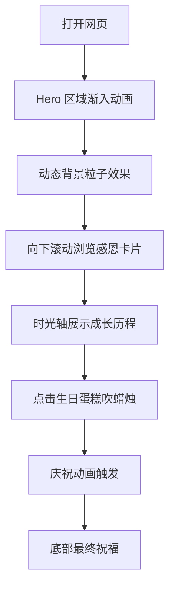

## 1. 产品概述

妈妈生日祝福网页，一个充满温馨与感动的单页祝福网站，献给 1987 年 6 月 5 日出生的妈妈。通过精美的玻璃拟态设计、流畅的动态效果和真挚的感恩文字，传递对妈妈深深的爱与祝福。

- 核心价值：用独特的数字方式表达对妈妈的生日祝福，兼具视觉美感和情感温度
- 目标用户：作为生日礼物送给妈妈，或用于家庭生日庆祝场景

## 2. 核心功能

### 2.1 功能模块

1. **首页 Hero 区**：生日主题大标题、妈妈年龄计算、生日祝福主视觉
2. **感恩寄语区**：多段真挚的感恩文字卡片，玻璃拟态效果
3. **回忆时光轴**：从 1987 年至今的重要时刻时间线
4. **生日蛋糕动画**：可交互的生日蛋糕，点击吹蜡烛
5. **祝福语弹幕**：漂浮的爱心和祝福语粒子效果
6. **底部祝福**：最终的生日祝福和落款

### 2.2 页面详情

| 页面名称 | 模块名称 | 功能描述 |
|---------|---------|----------|
| 首页 | Hero 区域 | 渐变动态背景、生日快乐大标题、年龄实时计算、出生日信息展示 |
| 首页 | 感恩寄语卡片 | 3-4 张玻璃拟态卡片，包含不同主题的感恩话语 |
| 首页 | 时光轴 | 从出生到现在的关键节点时间线，纵向排列 |
| 首页 | 生日蛋糕 | CSS 绘制的生日蛋糕，蜡烛可点击熄灭，有庆祝动画 |
| 首页 | 漂浮粒子 | 爱心、星光、花瓣等动态粒子背景效果 |
| 首页 | 底部祝福 | 温馨的生日祝福语和落款 |

## 3. 核心流程

用户打开网页 → 渐入动画展示生日标题和年龄 → 向下滚动浏览感恩卡片 → 时光轴展示成长历程 → 点击生日蛋糕吹蜡烛 → 阅读最终祝福语

## 4. 用户界面设计

### 4.1 设计风格

- **主色调**：温暖粉色系 + 玫瑰金点缀（#FFB6C1, #FF69B4, #D4A574, #FFD700）
- **背景**：深紫色到粉红色的渐变流动背景，叠加柔和光晕
- **玻璃拟态**：半透明模糊背景卡片（backdrop-filter: blur），白色细边框，柔和阴影
- **按钮**：圆角胶囊形，渐变填充，悬停时有缩放和光晕效果
- **字体**：优雅的衬线字体用于标题（Playfair Display / Noto Serif SC），圆润无衬线用于正文
- **动效**：丝滑的淡入上升动画、浮动效果、鼠标跟随光晕、粒子飘动

### 4.2 页面设计概览

| 页面名称 | 模块名称 | UI 元素 |
|---------|---------|---------|
| 首页 | Hero 区域 | 渐变流动背景、大标题文字渐变、数字年龄动画、玻璃态信息卡 |
| 首页 | 感恩卡片 | 毛玻璃卡片、图标+文字、悬停上浮效果、交错动画入场 |
| 首页 | 时光轴 | 纵向时间线、圆点节点、玻璃态内容卡、滚动触发动画 |
| 首页 | 生日蛋糕 | CSS 3D 蛋糕、蜡烛火焰动画、点击熄灭、彩带庆祝效果 |
| 首页 | 粒子背景 | 爱心、星光、花瓣随机飘落，鼠标交互 |
| 首页 | 底部祝福 | 艺术字体祝福语、签名样式落款 |

### 4.3 响应式设计

- 桌面端优先设计，完美适配 1440px 及以上
- 移动端自适应布局，卡片堆叠显示，字号适当缩小
- 触摸设备优化点击区域，确保交互友好
