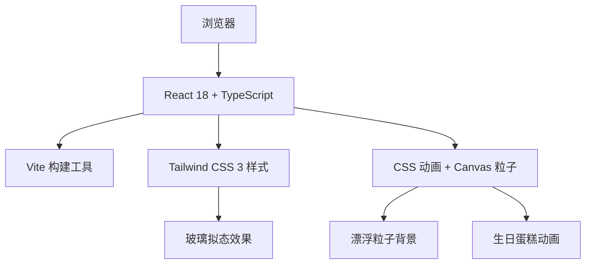

## 1. 架构设计



## 2. 技术说明

- 前端：React@18 + TypeScript + Tailwind CSS@3 + Vite@6
- 初始化工具：vite-init
- 后端：无（纯前端单页应用）
- 动画：CSS Keyframes + requestAnimationFrame + Canvas 粒子
- 字体：Google Fonts (Playfair Display + Noto Serif SC)

## 3. 路由定义

| 路由 | 用途 |
|------|------|
| / | 生日祝福主页（单页应用，所有内容在一个页面内） |

## 4. 组件结构

```
src/
├── components/
│   ├── HeroSection.tsx      # 主视觉区域
│   ├── GratitudeCards.tsx   # 感恩寄语卡片
│   ├── Timeline.tsx         # 时光轴
│   ├── BirthdayCake.tsx     # 生日蛋糕
│   ├── FloatingParticles.tsx # 漂浮粒子
│   └── FooterBlessing.tsx   # 底部祝福
├── hooks/
│   └── useAge.ts            # 年龄计算 hook
├── App.tsx                  # 主应用
├── main.tsx                 # 入口文件
└── index.css                # 全局样式
```

## 5. 核心数据

### 5.1 妈妈信息
- 出生日期：1987年6月5日
- 年龄：动态计算（当前年份 - 1987）

### 5.2 感恩卡片内容
- 卡片1：感谢养育之恩
- 卡片2：感谢无私付出
- 卡片3：感谢温暖陪伴
- 卡片4：祝愿幸福安康

### 5.3 时光轴节点
- 1987.06.05：出生
- 重要成长节点
- 成为妈妈的时刻
- 今天：生日快乐
